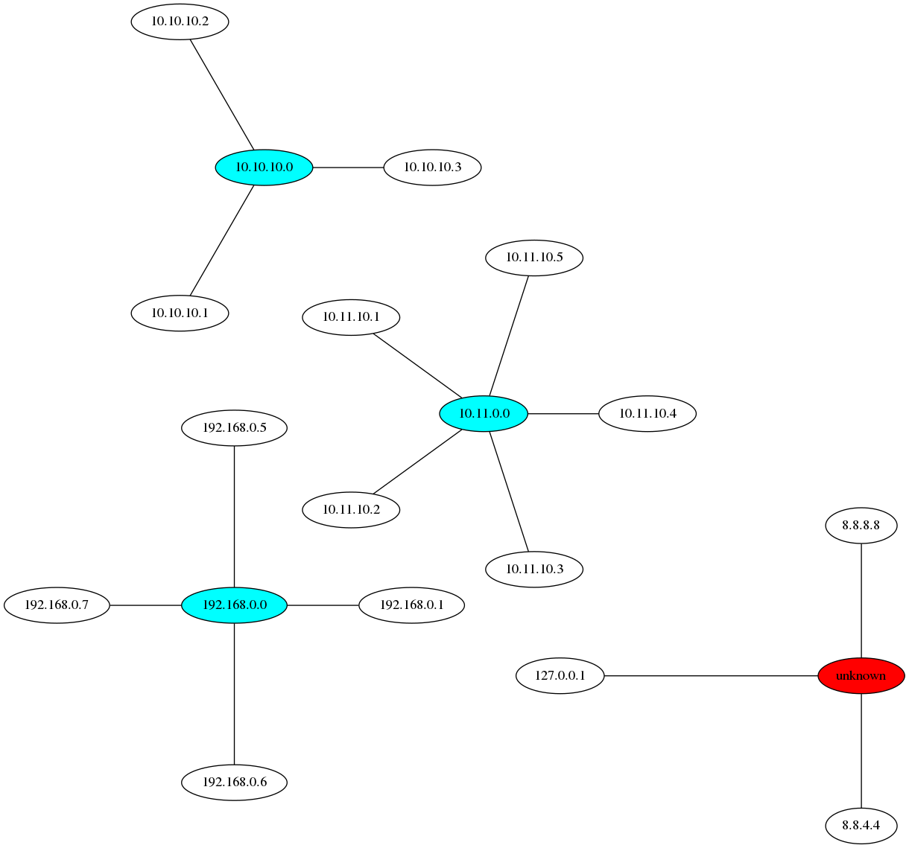

## Hosts file to network topology
`hosts2topology` generates a PNG based on the hosts file in the same directory.
The [CIDR](https://en.wikipedia.org/wiki/CIDR) info is extracted from the
comments. If IPs are listed that don't match a netmask they are connected to
the "unknown" network.
```bash
./hosts2topology
```
```bash
# CIDR network description
# 192.168.0.0/27

# Hosts - only the IP is used
192.168.0.1 neque
192.168.0.5 maxime
192.168.0.6 ea
```


