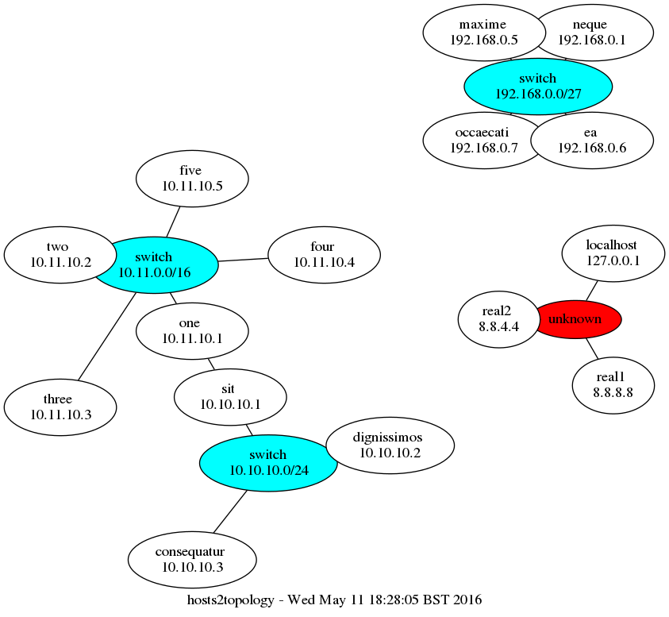

# Hosts file to network topology
By default `hosts2topology` takes a plaintext hosts file on stdin and creates a
file `topology.svg` in the current directory. The
[CIDR](https://en.wikipedia.org/wiki/CIDR) info is extracted from the comments
in the hosts file. If IPs are listed that don't match a netmask they are
connected to the "unknown" network.

The image is rendered using [Graphviz](http://graphviz.org).

```bash
./hosts2topology < hosts
```


Connections between subnets are indicated by adding a second IP in the comment
at the end of a line.

```bash
# CIDR network description
# 192.168.0.0/27

# Hosts - only the IP is used
192.168.0.1 neque
192.168.0.5 maxime
192.168.0.6 ea # 10.10.10.1

10.10.10.1 one
10.10.10.2 two
```

Output file name and type can be overridden by supplying a file name.

```bash
./hosts2topology one.jpg < hosts
./hosts2topology two.gif < hosts
```

##Alternative rendering engines
Graphviz supports various rendering engines which can be specified on the
command line.

```bash
./hosts2topology three.png fdp < hosts
```

Running `./generate_all` will create them all in the current directory.

###circo (the default)


###dot


###neato


###fdp


###sfdp


###twopi


###patchwork

